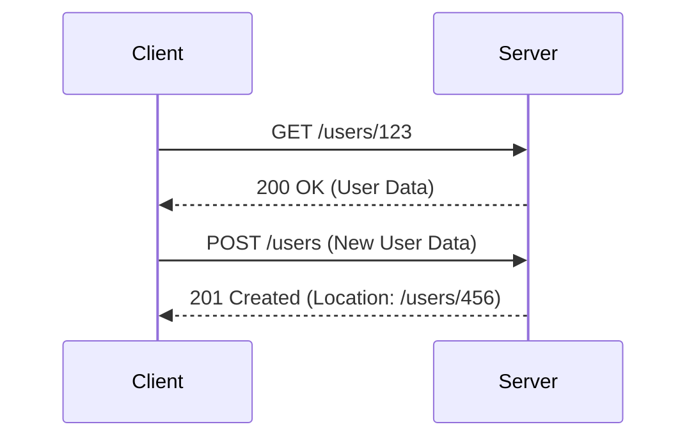
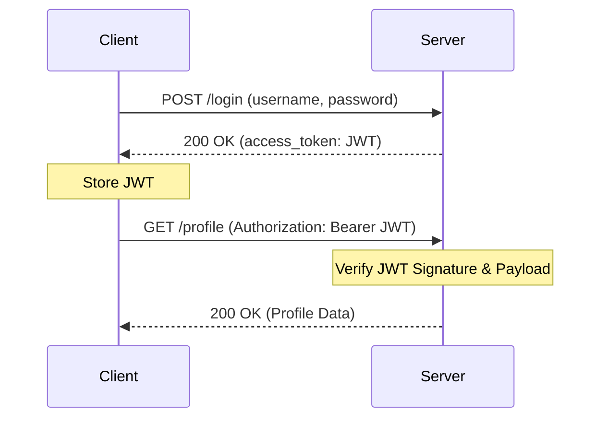
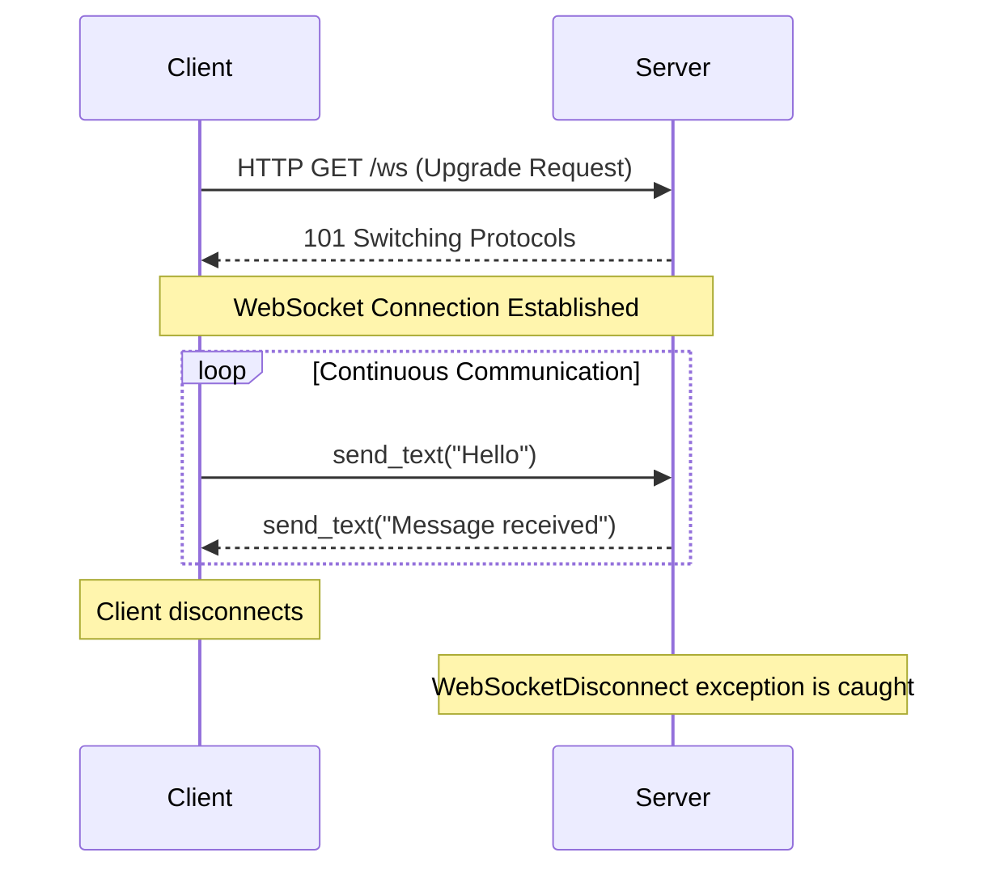

<<<<<<< HEAD
# API Fundamentals with FastAPI

This guide provides a comprehensive overview of the core concepts for building modern, robust APIs, focusing on REST principles and their practical implementation using the FastAPI framework.

---

## 1. HTTP Methods: The Verbs of the Web

HTTP methods, or verbs, define the action to be performed on a resource identified by a URI. Understanding their distinct properties—**safety** and **idempotency**—is crucial for designing a predictable RESTful API.

-   **Safety**: A method is "safe" if it does not alter the state of the server. Safe methods can be prefetched and cached without issue.
-   **Idempotency**: A method is "idempotent" if making the same request multiple times has the same effect as making it once. This allows clients to safely retry requests after a network failure.

| Method  | Action                               | Idempotent | Safe  | Use Case                                                              |
| :------ | :----------------------------------- | :--------- | :---- | :-------------------------------------------------------------------- |
| **GET**     | Retrieve a resource.                 | Yes        | Yes   | `GET /users/123` retrieves the profile for user 123.                  |
| **POST**    | Create a new resource.               | No         | No    | `POST /users` creates a new user from the data in the request body.   |
| **PUT**     | Replace an existing resource.        | Yes        | No    | `PUT /users/123` replaces the entire profile of user 123.             |
| **PATCH**   | Partially update an existing resource. | No         | No    | `PATCH /users/123` updates only the specified fields (e.g., email).   |
| **DELETE**  | Remove a resource.                   | Yes        | No    | `DELETE /users/123` deletes the user.                                 |

### Client-Server Interaction Diagram



---

## 2. HTTP Status Codes: The Server's Feedback

Status codes are the server's way of reporting the outcome of a request. They are grouped into five classes.

#### **2xx (Success)**
-   **200 OK**: The request succeeded. The standard response for successful `GET`, `PUT`, `PATCH`.
-   **201 Created**: The request succeeded, and a new resource was created. The standard response for a successful `POST`. The response should also contain a `Location` header pointing to the new resource's URI.
-   **204 No Content**: The server successfully processed the request but has no content to send back. Common for `DELETE` operations.

#### **4xx (Client Error) - "You messed up."**
-   **400 Bad Request**: The server cannot process the request due to a client-side error (e.g., malformed JSON, invalid request syntax).
-   **401 Unauthorized**: The client must authenticate itself to get the requested response. This means no or invalid authentication credentials were provided.
-   **403 Forbidden**: The client is authenticated, but does not have the necessary permissions for the resource.
-   **404 Not Found**: The server cannot find the requested resource.
-   **409 Conflict**: The request could not be completed due to a conflict with the current state of the resource (e.g., creating a user with an email that already exists).
-   **422 Unprocessable Entity**: The request was well-formed, but the server was unable to process the contained instructions due to semantic errors (e.g., a required field was missing). FastAPI uses this extensively for data validation errors.

#### **5xx (Server Error) - "I messed up."**
-   **500 Internal Server Error**: A generic, unexpected error occurred on the server that it doesn't know how to handle. This is your cue to check the server logs.

---

## 3. REST (REpresentational State Transfer) Principles

REST is an architectural style, not a protocol. An API is "RESTful" if it adheres to these constraints, which lead to scalable, decoupled, and maintainable systems.

-   **Client-Server Architecture**: Enforces a strict separation of concerns between the client (presentation) and the server (data storage and logic). They evolve independently.
-   **Statelessness**: Every request from a client must contain all the information necessary for the server to understand and process it. The server does not store any client session state between requests. This improves reliability and scalability.
-   **Cacheability**: Responses must implicitly or explicitly define themselves as cacheable or not. This allows clients or intermediaries to reuse response data, dramatically improving performance and reducing server load.
-   **Uniform Interface**: This is the core principle that simplifies and decouples the architecture. It has four sub-constraints:
    1.  **Resource Identification**: Resources are identified by stable URIs (e.g., `/users/123`).
    2.  **Manipulation Through Representations**: Clients manipulate resources through their representations (e.g., the JSON you `GET` or `PUT`).
    3.  **Self-Descriptive Messages**: Each message includes enough information to describe how to process it (e.g., using the `Content-Type` header to specify the media type like `application/json`).
    4.  **HATEOAS (Hypermedia as the Engine of Application State)**: The server's response should include links (hypermedia) that tell the client what actions they can take next. This allows the client to navigate the API dynamically.

---

## 4. OpenAPI and Interactive Docs

FastAPI automatically generates a machine-readable API schema following the **OpenAPI Specification**. This schema is a detailed JSON object that describes every part of your API, enabling powerful tooling:

-   **Automated Validation**: Incoming requests and outgoing responses are validated against the schema.
-   **Code Generation**: Client libraries can be automatically generated in various languages.
-   **Interactive Documentation**: FastAPI provides two documentation interfaces out-of-the-box:
    -   **Swagger UI**: A rich, interactive UI to explore and test your API endpoints directly from the browser. URL: `http://localhost:8000/docs`
    -   **ReDoc**: An alternative, clean, and readable documentation presentation. URL: `http://localhost:8000/redoc`

---

## 5. FastAPI Core Features

### Exceptions
FastAPI uses `HTTPException` to gracefully handle business logic errors. When raised, it halts processing and immediately sends a formatted HTTP error response to the client. You can also define custom exception handlers with the `@app.exception_handler()` decorator for more control over error responses.

### Dependencies with `yield`: Setup and Teardown
A dependency can use `yield` to run "setup" code before an endpoint (e.g., open a database connection) and "teardown" code after it has finished (e.g., close the connection). The teardown code is guaranteed to run via a `finally` block, even if an error occurs in the endpoint.

#### `yield` Dependency Flow

```mermaid
graph TD
    A[Request Received] --> B{Dependency with yield};
    B --> C[Setup Code Executes<br/>(e.g., open DB connection)];
    C --> D{Yields Resource to Endpoint};
    D --> E[Endpoint Logic Executes];
    E --> F{Response is Sent};
    F --> G[Teardown Code Executes<br/>(e.g., close DB connection)];
```

---

## 6. Database Integration

### ORM and SQLAlchemy
An **Object-Relational Mapper (ORM)** like **SQLAlchemy** translates between Python objects and relational database tables. This allows you to work with your data in an object-oriented way, while the ORM handles the generation of safe and efficient SQL. SQLAlchemy's first-class `asyncio` support makes it a perfect match for FastAPI's asynchronous nature.

### Database Migrations with Alembic
**Alembic** is the migration tool for SQLAlchemy, providing a version control system for your database schema. When you change your SQLAlchemy models, you use Alembic to generate and apply migration scripts that safely alter your database structure without losing data.

**Common Workflow:**
1.  Modify your models in `app/models.py`.
2.  Run `alembic revision --autogenerate -m "Description of changes"` to create a new migration script.
3.  Review the generated script in `alembic/versions/`.
4.  Run `alembic upgrade head` to apply the changes to the database.

---

## 7. Authorization with JWT

**JSON Web Tokens (JWT)** are the industry standard for creating access tokens for an API, enabling stateless authentication.

1.  **Login**: A user sends their credentials (e.g., username/password) to a login endpoint.
2.  **Token Generation**: The server validates the credentials and, if successful, generates a JWT.
3.  **Token Storage**: The server sends the JWT back to the client, which stores it securely (e.g., in an `HttpOnly` cookie or memory).
4.  **Authenticated Requests**: For subsequent requests to protected endpoints, the client includes the JWT in the `Authorization` header (e.g., `Authorization: Bearer <token>`).
5.  **Token Verification**: The server verifies the JWT's signature using a secret key to authenticate the request.

#### JWT Authentication Flow



---

## 8. WebSockets for Real-Time Communication

WebSockets provide a persistent, full-duplex (two-way) communication channel over a single TCP connection, breaking the request-response cycle of HTTP. This is ideal for real-time applications like chat, live notifications, or financial data streams.

In FastAPI, you define a WebSocket endpoint with the `@app.websocket()` decorator.

#### WebSocket Lifecycle
1.  **Handshake**: The client sends an HTTP `GET` request with an `Upgrade: websocket` header. The server accepts with a `101 Switching Protocols` response, establishing the connection.
2.  **Data Transfer**: The client and server can now send messages to each other asynchronously.
3.  **Connection Close**: When the client disconnects, a `WebSocketDisconnect` exception is raised on the server, allowing for graceful cleanup.

#### WebSocket Communication Diagram



---

## 9. Project Setup and Execution

This section provides a step-by-step guide to set up and run the various components of this FastAPI project.

### Prerequisites

*   Python 3.8+
*   A running PostgreSQL server.

### Step 1: Environment and Dependencies

1.  **Create and Activate Virtual Environment**:
    From the root `API` directory, run:
    ```bash
    # For Windows
    python -m venv venv
    .\venv\Scripts\activate

    # For macOS/Linux
    python3 -m venv venv
    source venv/bin/activate
    ```

2.  **Install Dependencies**:
    Install all necessary packages from the `requirements.txt` file.
    ```bash
    pip install -r requirements.txt
    ```

### Step 2: Database Setup

This project uses a PostgreSQL database named `fastapidb`.

1.  **Create the Database**:
    Ensure your PostgreSQL server is running. The `create_database.py` script can create the database for you. It uses the credentials found in `app/database.py`.
    ```bash
    python create_database.py
    ```

2.  **Apply Database Migrations**:
    Use Alembic to create or update the tables in your database to match the models defined in `app/models.py`.
    ```bash
    # This command applies all pending migration scripts.
    alembic upgrade head
    ```

### Step 3: Running the Applications

#### A. Main CRUD Application

The primary application featuring asynchronous CRUD operations, authentication, and database integration is located in the `app/` directory.

1.  **Run the Server**:
    From the root `API` directory, run the application using `uvicorn`. The `--app-dir .` flag is important to resolve the relative imports correctly.
    ```bash
    uvicorn app.main:app --reload --app-dir .
    ```

2.  **Access the API**:
    -   **Interactive Docs (Swagger UI)**: [http://127.0.0.1:8000/docs](http://127.0.0.1:8000/docs)
    -   **Alternative Docs (ReDoc)**: [http://127.0.0.1:8000/redoc](http://127.0.0.1:8000/redoc)

#### B. WebSocket Chat Application

A simple real-time chat example using WebSockets is in the `Sockets/` directory.

1.  **Run the Server**:
    From the root `API` directory, start the WebSocket server.
    ```bash
    uvicorn Sockets.main:app --reload
    ```

2.  **Access the Chat Client**:
    Open your browser and navigate to [http://12.0.0.1:8000/](http://127.0.0.1:8000/). You will see a simple HTML page where you can send and receive messages in real-time.
```<!-- filepath: c:\Users\ujwal\OneDrive\Documents\Python modules\PythonBasics_and_Modules\API\readme.md -->
# API Fundamentals with FastAPI

This guide provides a comprehensive overview of the core concepts for building modern, robust APIs, focusing on REST principles and their practical implementation using the FastAPI framework.

---

## 1. HTTP Methods: The Verbs of the Web

HTTP methods, or verbs, define the action to be performed on a resource identified by a URI. Understanding their distinct properties—**safety** and **idempotency**—is crucial for designing a predictable RESTful API.

-   **Safety**: A method is "safe" if it does not alter the state of the server. Safe methods can be prefetched and cached without issue.
-   **Idempotency**: A method is "idempotent" if making the same request multiple times has the same effect as making it once. This allows clients to safely retry requests after a network failure.

| Method  | Action                               | Idempotent | Safe  | Use Case                                                              |
| :------ | :----------------------------------- | :--------- | :---- | :-------------------------------------------------------------------- |
| **GET**     | Retrieve a resource.                 | Yes        | Yes   | `GET /users/123` retrieves the profile for user 123.                  |
| **POST**    | Create a new resource.               | No         | No    | `POST /users` creates a new user from the data in the request body.   |
| **PUT**     | Replace an existing resource.        | Yes        | No    | `PUT /users/123` replaces the entire profile of user 123.             |
| **PATCH**   | Partially update an existing resource. | No         | No    | `PATCH /users/123` updates only the specified fields (e.g., email).   |
| **DELETE**  | Remove a resource.                   | Yes        | No    | `DELETE /users/123` deletes the user.                                 |

### Client-Server Interaction Diagram


---

## 2. HTTP Status Codes: The Server's Feedback

Status codes are the server's way of reporting the outcome of a request. They are grouped into five classes.

#### **2xx (Success)**
-   **200 OK**: The request succeeded. The standard response for successful `GET`, `PUT`, `PATCH`.
-   **201 Created**: The request succeeded, and a new resource was created. The standard response for a successful `POST`. The response should also contain a `Location` header pointing to the new resource's URI.
-   **204 No Content**: The server successfully processed the request but has no content to send back. Common for `DELETE` operations.

#### **4xx (Client Error) - "You messed up."**
-   **400 Bad Request**: The server cannot process the request due to a client-side error (e.g., malformed JSON, invalid request syntax).
-   **401 Unauthorized**: The client must authenticate itself to get the requested response. This means no or invalid authentication credentials were provided.
-   **403 Forbidden**: The client is authenticated, but does not have the necessary permissions for the resource.
-   **404 Not Found**: The server cannot find the requested resource.
-   **409 Conflict**: The request could not be completed due to a conflict with the current state of the resource (e.g., creating a user with an email that already exists).
-   **422 Unprocessable Entity**: The request was well-formed, but the server was unable to process the contained instructions due to semantic errors (e.g., a required field was missing). FastAPI uses this extensively for data validation errors.

#### **5xx (Server Error) - "I messed up."**
-   **500 Internal Server Error**: A generic, unexpected error occurred on the server that it doesn't know how to handle. This is your cue to check the server logs.

---

## 3. REST (REpresentational State Transfer) Principles

REST is an architectural style, not a protocol. An API is "RESTful" if it adheres to these constraints, which lead to scalable, decoupled, and maintainable systems.

-   **Client-Server Architecture**: Enforces a strict separation of concerns between the client (presentation) and the server (data storage and logic). They evolve independently.
-   **Statelessness**: Every request from a client must contain all the information necessary for the server to understand and process it. The server does not store any client session state between requests. This improves reliability and scalability.
-   **Cacheability**: Responses must implicitly or explicitly define themselves as cacheable or not. This allows clients or intermediaries to reuse response data, dramatically improving performance and reducing server load.
-   **Uniform Interface**: This is the core principle that simplifies and decouples the architecture. It has four sub-constraints:
    1.  **Resource Identification**: Resources are identified by stable URIs (e.g., `/users/123`).
    2.  **Manipulation Through Representations**: Clients manipulate resources through their representations (e.g., the JSON you `GET` or `PUT`).
    3.  **Self-Descriptive Messages**: Each message includes enough information to describe how to process it (e.g., using the `Content-Type` header to specify the media type like `application/json`).
    4.  **HATEOAS (Hypermedia as the Engine of Application State)**: The server's response should include links (hypermedia) that tell the client what actions they can take next. This allows the client to navigate the API dynamically.

---

## 4. OpenAPI and Interactive Docs

FastAPI automatically generates a machine-readable API schema following the **OpenAPI Specification**. This schema is a detailed JSON object that describes every part of your API, enabling powerful tooling:

-   **Automated Validation**: Incoming requests and outgoing responses are validated against the schema.
-   **Code Generation**: Client libraries can be automatically generated in various languages.
-   **Interactive Documentation**: FastAPI provides two documentation interfaces out-of-the-box:
    -   **Swagger UI**: A rich, interactive UI to explore and test your API endpoints directly from the browser. URL: `http://localhost:8000/docs`
    -   **ReDoc**: An alternative, clean, and readable documentation presentation. URL: `http://localhost:8000/redoc`

---

## 5. FastAPI Core Features

### Exceptions
FastAPI uses `HTTPException` to gracefully handle business logic errors. When raised, it halts processing and immediately sends a formatted HTTP error response to the client. You can also define custom exception handlers with the `@app.exception_handler()` decorator for more control over error responses.

### Dependencies with `yield`: Setup and Teardown
A dependency can use `yield` to run "setup" code before an endpoint (e.g., open a database connection) and "teardown" code after it has finished (e.g., close the connection). The teardown code is guaranteed to run via a `finally` block, even if an error occurs in the endpoint.

#### `yield` Dependency Flow

```mermaid
graph TD
    A[Request Received] --> B{Dependency with yield};
    B --> C[Setup Code Executes<br/>(e.g., open DB connection)];
    C --> D{Yields Resource to Endpoint};
    D --> E[Endpoint Logic Executes];
    E --> F{Response is Sent};
    F --> G[Teardown Code Executes<br/>(e.g., close DB connection)];
```

---

## 6. Database Integration

### ORM and SQLAlchemy
An **Object-Relational Mapper (ORM)** like **SQLAlchemy** translates between Python objects and relational database tables. This allows you to work with your data in an object-oriented way, while the ORM handles the generation of safe and efficient SQL. SQLAlchemy's first-class `asyncio` support makes it a perfect match for FastAPI's asynchronous nature.

### Database Migrations with Alembic
**Alembic** is the migration tool for SQLAlchemy, providing a version control system for your database schema. When you change your SQLAlchemy models, you use Alembic to generate and apply migration scripts that safely alter your database structure without losing data.

**Common Workflow:**
1.  Modify your models in `app/models.py`.
2.  Run `alembic revision --autogenerate -m "Description of changes"` to create a new migration script.
3.  Review the generated script in `alembic/versions/`.
4.  Run `alembic upgrade head` to apply the changes to the database.

---

## 7. Authorization with JWT

**JSON Web Tokens (JWT)** are the industry standard for creating access tokens for an API, enabling stateless authentication.

1.  **Login**: A user sends their credentials (e.g., username/password) to a login endpoint.
2.  **Token Generation**: The server validates the credentials and, if successful, generates a JWT.
3.  **Token Storage**: The server sends the JWT back to the client, which stores it securely (e.g., in an `HttpOnly` cookie or memory).
4.  **Authenticated Requests**: For subsequent requests to protected endpoints, the client includes the JWT in the `Authorization` header (e.g., `Authorization: Bearer <token>`).
5.  **Token Verification**: The server verifies the JWT's signature using a secret key to authenticate the request.

#### JWT Authentication Flow


---

## 8. WebSockets for Real-Time Communication

WebSockets provide a persistent, full-duplex (two-way) communication channel over a single TCP connection, breaking the request-response cycle of HTTP. This is ideal for real-time applications like chat, live notifications, or financial data streams.

In FastAPI, you define a WebSocket endpoint with the `@app.websocket()` decorator.

#### WebSocket Lifecycle
1.  **Handshake**: The client sends an HTTP `GET` request with an `Upgrade: websocket` header. The server accepts with a `101 Switching Protocols` response, establishing the connection.
2.  **Data Transfer**: The client and server can now send messages to each other asynchronously.
3.  **Connection Close**: When the client disconnects, a `WebSocketDisconnect` exception is raised on the server, allowing for graceful cleanup.

#### WebSocket Communication Diagram


---

## 9. Project Setup and Execution

This section provides a step-by-step guide to set up and run the various components of this FastAPI project.

### Prerequisites

*   Python 3.8+
*   A running PostgreSQL server.

### Step 1: Environment and Dependencies

1.  **Create and Activate Virtual Environment**:
    From the root `API` directory, run:
    ```bash
    # For Windows
    python -m venv venv
    .\venv\Scripts\activate

    # For macOS/Linux
    python3 -m venv venv
    source venv/bin/activate
    ```

2.  **Install Dependencies**:
    Install all necessary packages from the `requirements.txt` file.
    ```bash
    pip install -r requirements.txt
    ```

### Step 2: Database Setup

This project uses a PostgreSQL database named `fastapidb`.

1.  **Create the Database**:
    Ensure your PostgreSQL server is running. The `create_database.py` script can create the database for you. It uses the credentials found in `app/database.py`.
    ```bash
    python create_database.py
    ```

2.  **Apply Database Migrations**:
    Use Alembic to create or update the tables in your database to match the models defined in `app/models.py`.
    ```bash
    # This command applies all pending migration scripts.
    alembic upgrade head
    ```

### Step 3: Running the Applications

#### A. Main CRUD Application

The primary application featuring asynchronous CRUD operations, authentication, and database integration is located in the `app/` directory.

1.  **Run the Server**:
    From the root `API` directory, run the application using `uvicorn`. The `--app-dir .` flag is important to resolve the relative imports correctly.
    ```bash
    uvicorn app.main:app --reload --app-dir .
    ```

2.  **Access the API**:
    -   **Interactive Docs (Swagger UI)**: [http://127.0.0.1:8000/docs](http://127.0.0.1:8000/docs)
    -   **Alternative Docs (ReDoc)**: [http://127.0.0.1:8000/redoc](http://127.0.0.1:8000/redoc)

#### B. WebSocket Chat Application

A simple real-time chat example using WebSockets is in the `Sockets/` directory.

1.  **Run the Server**:
    From the root `API` directory, start the WebSocket server.
    ```bash
    uvicorn Sockets.main:app --reload
    ```

2.  **Access the Chat Client**:
    Open your browser and navigate to [http://12.0.0.1:8000/](http://127.0.0.1:8000/). You will see a simple HTML page where you can send and receive messages in real-
=======
alembic init alembic
alembic revision --autogenerate -m "Create items table"
alembic upgrade head
>>>>>>> b8a759b11ff777e5ae0265945f580940e52dcfd0
